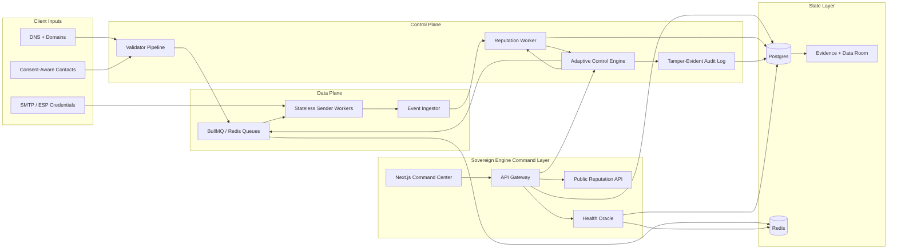
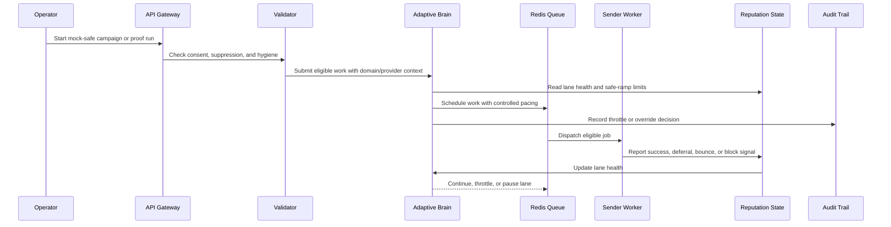
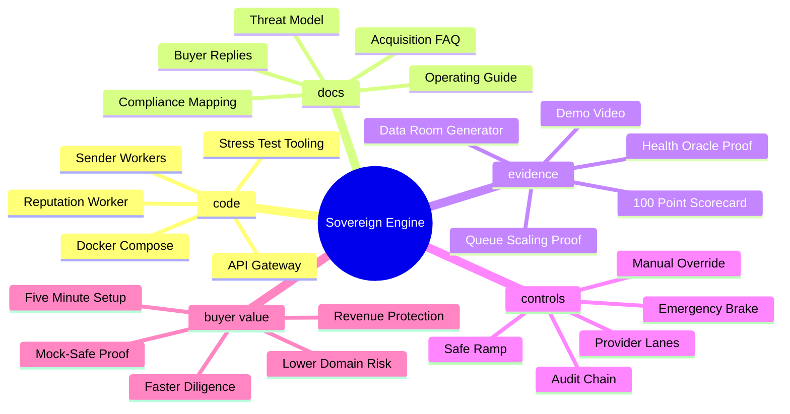
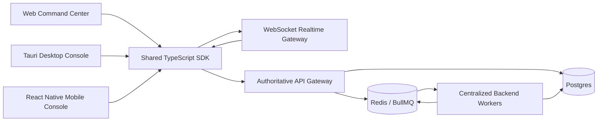

# Sovereign Engine


## Repository Layout

```text
/
├── code/       The hardened private repo: API gateway, workers, Docker, scripts
├── docs/       Compliance Mapping, Threat Model, and buyer diligence docs
└── evidence/   100/100 Test Reports, proof scorecard, and repeatable validation
```

Run command examples from the hardened engine folder:

```bash
cd code
```

## 24/7 Cloud Operation

This repo includes a Render Blueprint at [`render.yaml`](render.yaml) for the API, reputation worker, sender worker, Postgres, Redis-compatible Key Value, and a guarded outbound cron.

Read the cloud runbook before enabling real sending: [docs/cloud/RENDER_24_7_RUNBOOK.md](docs/cloud/RENDER_24_7_RUNBOOK.md)

## Acquisition Demo Video

[](docs/assets/sovereign-engine-acquisition-demo.mp4)

Watch the buyer demo: [sovereign-engine-acquisition-demo.mp4](docs/assets/sovereign-engine-acquisition-demo.mp4)

Demo page for GitHub/due diligence: [docs/demo.md](docs/demo.md)

## Deliverability Operating System for Outbound Revenue Teams

Sovereign Engine is a deliverability operating system for outbound revenue teams.

It protects outbound revenue by monitoring domain health, controlling sending pressure, tracking inbox-placement signals, and surfacing reputation risk before domains burn.

The core idea is simple:

```text
Validate -> Decide -> Queue -> Shape -> Send -> Measure -> Learn -> Protect
```

Sovereign Engine is designed to make sending decisions like an infrastructure brain, not a blast tool.

## Architecture Diagrams

### System Architecture



### Adaptive Send Flow



### Buyer Due-Diligence Mindmap



### Cross-Platform Control Plane



Sovereign Engine now has the enterprise platform shape buyers expect:

- Web remains the primary Next.js control plane.
- Desktop consoles are Tauri shells for macOS, Windows, and Linux.
- Mobile consoles are React Native shells for Android and iOS alerts and approvals.
- `@sovereign/platform-sdk` gives every client one shared API, auth, and realtime layer.
- The realtime gateway streams lane, health, worker, and audit-backed operational events.
- Clients are control consoles only. Redis, BullMQ, Postgres writes, queue shaping, and sending remain centralized in the backend.

## Acquisition Positioning

```text
Protect outbound revenue before domains burn.
Control inbox placement, sender reputation, and queue pressure from one operating system.
Replace fragile sending setups with infrastructure built for revenue preservation.
```

Pricing signal:

- Starter: `$299/mo`
- Growth: `$799/mo`
- Enterprise: `Custom`

Buyer commands:

```bash
cd code
pnpm deploy:production   # start services and verify production-style health
pnpm demo:investor       # open reputation dashboard, live metrics, and worker proof
pnpm generate:data-room  # architecture, API docs, scaling proof, screenshots/assets
pnpm platform:check      # validate web/desktop/mobile consoles stay control-plane only
```

Monetization/API signals:

```text
GET  /demo/metrics
POST /api/v1/license/validate
GET  /api/v1/api-keys
POST /api/v1/api-keys
```

No revenue, customer, or traction claims are made. Demo metrics are simulated and clearly labeled.

## Final Client Inputs

Sovereign Engine ships the platform. The client only needs to supply the external assets that must legally and operationally belong to them:

- VPS/cloud host or container platform.
- Dashboard domain with HTTPS, for example `orbit.client.com`.
- Sending domains, inboxes, and DNS access.
- SPF, DKIM, DMARC, MX/provider verification, and tracking-domain records where used.
- SMTP or ESP credentials such as SES, Brevo, Resend, Mailgun, SendGrid, or a managed MTA.
- Email validation key such as `ZEROBOUNCE_API_KEY`.
- Consent-aware contact data, suppression list, unsubscribe policy, and physical mailing address where required.

Everything else is handled by this repo: database schema, Redis queues, adaptive controller, workers, dashboards, health checks, audit chain, mock stress proof, and Docker production orchestration.

## Why Buyers Care

Outbound teams do not lose money because they lack another template editor. They lose money because their infrastructure fails.

Common failure modes:

- Domains burn before campaigns reach meaningful volume.
- Gmail, Outlook, Yahoo, and iCloud are treated like one generic inbox.
- Operators send too fast because the system has no adaptive brake.
- Teams cannot prove what happened when a campaign fails.
- Scaling requires manual babysitting in terminals.

Sovereign Engine solves this by combining provider-aware reputation control, safe ramping, idempotent queueing, worker heartbeats, and a visual command center.

## What Makes It Different

- Reputation-first architecture: every send is controlled by domain and provider lane health.
- Provider lanes: Gmail, Outlook, Yahoo, and iCloud can be throttled or paused independently.
- Safe ramp: new or recovering domains start conservatively and scale only when signals stay healthy.
- Emergency brake: high-risk lanes can be paused automatically or manually.
- Exactly-once discipline: idempotency protects against accidental duplicate sends.
- Production observability: health stats expose DB latency, Redis latency, queue depth, and worker nodes.
- Buyer-ready dashboard: the `/reputation` command center shows the system thinking in real time.
- Public Reputation API: internal reputation intelligence can be productized as Reputation-as-a-Service.

## The Command Center

Open:

```text
/reputation
```

The command center includes:

- Lane status grid for Gmail, Outlook, Yahoo, and iCloud.
- Safe-ramp graph showing `max_per_hour` changes over time.
- Live Brain Feed from `reputation_events`.
- Tenant and domain filters.
- Manual lane pause/resume controls.
- Pause All and Resume controls that write to Postgres and Redis.
- Value Ticker: estimated inboxed emails x `$0.50` average lead value.

Investor mode:

```text
/reputation?investor=1
```

Investor mode shows value generated, sending cost, gross margin, ROI multiple, and projected daily capacity.

## Buyer-Ready Operating Screens

The dashboard now includes the handoff surfaces a serious buyer expects during diligence:

- `/dashboard`: one-click Buyer Demo Kit, readiness score, Due Diligence PDF export, and Worker Live Map.
- `/setup`: production readiness wizard with environment checks, DNS verification, SMTP readiness, compliance controls, and a printable report.
- `/proof`: single-screen proof board for recording health, workers, readiness, scale commands, and diligence downloads.
- `/trust`: enterprise trust center with safe buyer language, production-gate proof, and client-input boundaries.
- `/limits`: honest known-limits and production-gate notes for due diligence.
- `/activity`: replay feed that blends Reputation Brain decisions, delivery events, and tamper-evident audit actions.
- `/raas`: public Reputation-as-a-Service console with cURL snippet, OpenAPI links, API-key testing, and health certificate output.
- `/demo-import`: safe CSV import flow using reserved demo domains, so demos never require real prospect data.
- `/handoff`: final buyer handoff center with Data Room ZIP and PDF packet downloads.

These pages are intentionally safe-by-default. They make the product easier to sell and operate without bypassing domain ownership, provider credentials, suppression policy, or compliance checks.

The header also includes Recording Mode. Turn it on before Loom/OBS capture to hide demo noise and keep the command center clean on video.
The dashboard includes Prepare Recording, which seeds safe demo data and turns Recording Mode on in one click.

## Production Proof

Sovereign Engine includes production-grade proof surfaces for technical buyers:

```text
/api/health/stats
/api/setup/readiness?domain=example.com
/api/setup/report?domain=example.com
/api/due-diligence/report?domain=example.com
/api/handoff/data-room?domain=example.com
/api/production/gate?domain=example.com
/api/trust/summary?domain=example.com
/api/activity/replay
```

Health stats expose:

- Redis SET/GET latency.
- Postgres `reputation_state` query latency.
- BullMQ waiting/active/delayed/failed counts.
- Sender-worker heartbeat nodes.
- DB queue depth.
- Downloadable due-diligence PDF with readiness, worker, queue, audit, and security proof.
- Downloadable Data Room ZIP with summary, proof metrics, buyer inputs, setup commands, DNS suggestions, next actions, and security controls.
- Production gate JSON that makes demo-ready versus production-ready status explicit.

## Final QA Commands

Run the complete one-command launch/submission check:

```bash
pnpm launch:ready
```

This starts the safe production Docker stack, checks buyer-facing copy, runs the production dry-run gate,
validates Docker Compose, starts the API and workers, runs live endpoint checks, and creates an evidence pack
under `code/output/launch-ready/latest`.

For deeper local checks, run:

```bash
pnpm launch:ready --with-browser
pnpm launch:ready --with-build
pnpm launch:ready --with-typecheck
```

Stop the launched Docker stack:

```bash
pnpm launch:stop
```

Run the full local demo doctor:

```bash
pnpm doctor:demo
```

Run browser QA with screenshots:

```bash
pnpm qa:demo
```

Run buyer-facing copy safety checks:

```bash
pnpm copy:check
```

Generate the final submission evidence folder:

```bash
pnpm submit:pack
```

Generate the pack and run browser QA inside it:

```bash
pnpm submit:pack:qa
```

This makes the system inspectable during demos, due diligence, and production operations.

## Buyer Demo Mode

Run the full mock-safe buyer demo prep:

```bash
docker ps
pnpm demo:buyer
```

This starts Postgres and Redis, applies the schema, creates the demo user, starts the API gateway on `localhost:3400`, starts the reputation and sender workers, and opens the key demo pages.

Demo login:

```text
demo@sovereign.local
Demo1234!
```

Stop background demo processes:

```bash
pnpm demo:buyer:stop
```

Full walkthrough:

```text
docs/BUYER_DEMO_GUIDE.md
docs/VIDEO_RECORDING_GUIDE.md
docs/TECHNICAL_PROOF_CHECKLIST.md
```

Generate clean Sovereign Engine B-roll clips and package them for sharing:

```bash
pnpm demo:clips
pnpm demo:package
```

## Scale Proof

Sovereign Engine includes an internal mock stress test to prove pipeline throughput without sending real email:

```bash
MOCK_SMTP=true MOCK_SMTP_FASTLANE=true SENDER_WORKER_CONCURRENCY=50 pnpm worker:sender
STRESS_COUNT=10000 STRESS_TIMEOUT_MS=60000 pnpm stress:test
```

The stress test simulates the full internal flow:

```text
Validator-approved contacts -> Queue jobs -> Redis queue -> Sender worker -> Event ingest -> Postgres
```

This is the proof path for showing controlled mock sends through the engine before real delivery is enabled. The 10,000-send target depends on the host, Postgres disk speed, worker count, and DB pool sizing; use it as a production capacity proof on the final VPS/cloud box, not as a promise from a laptop Docker runtime.

Real sending should always follow DNS authentication, consent, suppression, provider policy, and safe ramp limits.

## Production Docker

Run the production stack:

```bash
docker compose -f code/docker-compose.prod.yml up -d --build --scale sender-worker=2
```

Scale workers horizontally:

```bash
docker compose -f code/docker-compose.prod.yml up -d --scale sender-worker=8
```

Included services:

- API Gateway: dashboard and API routes.
- Reputation Worker: adaptive control brain.
- Sender Workers: stateless sending muscle.
- Postgres: durable state and audit history.
- Redis: queueing, lane signals, heartbeats, rate shaping.

## Five-Minute Setup

Fresh machine:

```bash
cd code
./setup.sh
```

The setup script:

- Creates `.env` with safe defaults.
- Starts Postgres and Redis when Docker is available.
- Installs workspace dependencies.
- Applies database schema.
- Creates a demo user.
- Keeps `MOCK_SMTP=true` by default so demos do not send real mail.

Start local app:

```bash
pnpm dev -p 3000
```

Start workers:

```bash
pnpm worker:reputation
pnpm worker:sender
```

Final production check:

```bash
cp configs/env/.env.production.example .env
pnpm prod:check
pnpm prod:check:real
```

Use `pnpm prod:check` while staying in mock mode. Use `pnpm prod:check:real` only after live SMTP/ESP credentials, DNS, validation, HTTPS, and secrets are filled.

## Reputation-as-a-Service API

Sovereign Engine productizes its internal intelligence as a public API.

Endpoint:

```text
POST /api/v1/reputation/score
```

Example:

```bash
curl -X POST "http://localhost:3000/api/v1/reputation/score" \
  -H "x-api-key: $SOVEREIGN_REPUTATION_API_KEY" \
  -H "content-type: application/json" \
  -d '{"domain":"example.com","ip":"1.2.3.4"}'
```

Returns a health certificate:

- Reputation score from 0 to 100.
- Provider status for Gmail, Outlook, and Yahoo.
- Blacklist status.
- Autonomous recommendation.
- Billing usage metadata.

Developer docs:

```text
/api/v1/reputation/docs
/api/v1/reputation/openapi.json
```

## Commercial Positioning

Sovereign Engine can be sold or licensed as:

- Deliverability Operating System for B2B outbound.
- Agency control plane for multi-client sending.
- Reputation-as-a-Service API.
- Production infrastructure starter for compliant outbound platforms.
- Due-diligence-ready acquisition asset for founders who need proof, not pitch decks.

The valuation story is not “we send emails.”

The valuation story is:

```text
We built the control layer that protects outbound revenue.
```

## Safety and Compliance

Sovereign Engine is built for sustainable deliverability, not deception.

The system is designed around:

- SPF, DKIM, DMARC, and DNS preflight checks.
- Suppression lists and bounce/complaint protection.
- Provider-aware pacing.
- Audit trails for throttle, pause, resume, and ramp events.
- Masked logs for emails, tokens, passwords, and secrets.
- Mock mode for demos and stress tests.
- Kill-switch support for breach response.

It should be used only with lawful, consent-aware, policy-compliant sending programs.

## Architecture

```text
Contacts
  -> Validator
  -> Decision Engine
  -> Queue Jobs
  -> BullMQ / Redis
  -> Adaptive Controller
  -> Sender Workers
  -> Tracking Events
  -> Reputation State
  -> Command Center
```

Durable state lives in Postgres.

Real-time lane signals, worker heartbeats, rate buckets, and queues live in Redis.

Sender workers are stateless, which means capacity can be added by starting more workers.

## Core Tables

- `reputation_state`: current provider lane state.
- `reputation_events`: append-only brain decisions.
- `provider_health_snapshots`: deferral, block, success, throttle signals.
- `seed_placement_events`: inbox/spam placement measurements.
- `queue_jobs`: durable queued work.
- `events`: sent, failed, bounce, reply, complaint, and retry events.
- `public_api_keys`: hashed keys for Reputation API access.
- `reputation_api_logs`: billable API usage ledger.

## Demo Checklist for a Buyer

1. Run `cd code && ./setup.sh`.
2. Open `/dashboard`.
3. Open `/reputation`.
4. Start reputation and sender workers.
5. Run `pnpm prod:check`.
6. Open `/api/health/stats?client_id=1`.
7. Open `/reputation?investor=1`.
8. Show `reputation_events` updating after manual Pause/Resume.
9. Show worker heartbeat count increasing when sender workers are scaled.
10. Run mock stress proof, then show Docker Compose scaling with `--scale sender-worker=N`.

## Founder Note

Sovereign Engine exists because outbound is becoming an infrastructure problem.

The winners will not be the teams that send the most.

The winners will be the teams that know when not to send, how fast to ramp, when to pause, how to prove compliance, and how to protect the revenue engine before reputation damage becomes visible.

That is what this repo is built to become.

## License

MIT
